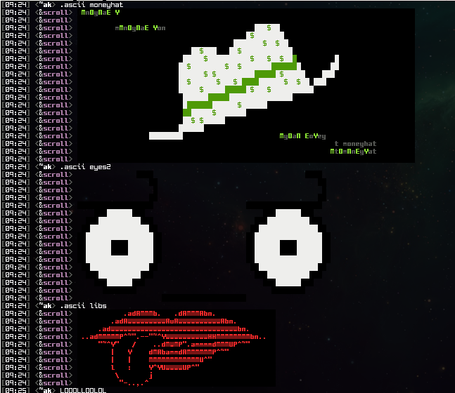

# scroll
> Scroll is full-featured IRC bot that carries a **PENIS PUMP** & will brighten up all the mundane chats in your lame IRC channels with some colorful IRC artwork! Designed to be extremely stable, this bot is sure to stay rock hard & handle itself quite well!

## Requirements
- [Python](https://www.python.org/downloads/) *(**Note:** This script was developed to be used with the latest version of Python)*
- [Pillow](https://pypi.org/project/Pillow/) *(Required by [core/mircart.py](scroll/core/mircart.py))*

## Setup
Edit the [core/config.py](scroll/core/config.py) file and then place your art files in the [data/art](scroll/data/art) directory.

This repository by itself does not contain any art. A large organized collection of IRC art can be cloned from the [ircart](https://github.com/ircart/ircart) repository directory into your [data/art](scroll/data/art) directory:

`git clone https://github.com/ircart/ircart.git $SCROLL_DIR/scroll/data/art` *(change the `$SCROLL_DIR` to where you cloned it)*

**Warning:** Try not to have any filenames in your [data/art](scroll/data/art) directory that are the same as any of the [Commands](#commands) below or you won't be able to play them!

## Commands
### User Commands
| Command                         | Description                                                                                                                                      |
| ------------------------------- | ------------------------------------------------------------------------------------------------------------------------------------------------ |
| @scroll                         | information about scroll                                                                                                                         |
| .ascii dirs                     | list of ascii directories                                                                                                                        |
| .ascii list                     | list of ascii filenames                                                                                                                          |
| .ascii png \<url>               | convert an art paste into an image *(must be a [Pastebin](https://pastebin.com/) or [Termbin](https://termbin.com/) link)*                       |
| .ascii random [dir]             | play random art, optionally from the [dir] directory only                                                                                        |
| .ascii remote \<url>            | play remote art pastes *(must be a [Pastebin](https://pastebin.com/) or [Termbin](https://termbin.com/) link)*                                   |
| .ascii search \<query>          | search [data/art](scroll/data/art) for \<query>                                                                                                  |
| .ascii stop                     | stop playing art                                                                                                                                 |
| .ascii upload [\<url> \<title>] | list of uploaded art pastes or upload \<url> as \<title> *(must be a [Pastebin](https://pastebin.com/) or [Termbin](https://termbin.com/) link)* |
| .ascii \<name> [\<trunc>]       | play \<name> art from [data/art](scroll/data/art) *(see usage below)*                                                                            |

#### Note
The \<trunc> argument for the `.ascii` command allows you to truncate lines off of an ASCII. The data is TOP,BOTTOM,LEFT,RIGHT,SPACES. Top being how many lines to remove from the top. Bottom being the same except from the bottom. Left and right remove characters from each side, and spaces will prefix lines with this many spaces.

**Example:** `.ascii funnyguy 3,5,0,10,30` *(This will remove 3 lines from the top, 5 lines from the bottom, no characters from the left, 10 characters from the right, and append 30 spaces before each line)*

### Admin Commands *(Private Message)*
| Command                       | Description                                                                                         |
| ----------------------------- | --------------------------------------------------------------------------------------------------- |
| .config [\<setting> \<value>] | view config or change \<setting> to \<value>                                                        |
| .ignore [\<add/del> \<ident>] | view ignore list or \<add/del> an \<ident> *(must be in nick!user@host format, wildcards accepted)* |
| .raw \<data>                  | send \<data> to the server                                                                          |
| .update                       | update the [data/art](scroll/data/art) directory *(see usage below)*                                |

#### Note
The `.update` command is if you cloned a git repository, like the one mentioned in the [Setup](#setup) section, for your [data/ascii](scroll/data/ascii) directory. This will simply perform a `git pull` on the repository to update it.

## Config Settings
| Setting         | Description                                                                           |
| --------------- | ------------------------------------------------------------------------------------- |
| max_lines       | maximum number of lines an art can be to be played outside of the **#scroll** channel |
| max_png_bytes   | maximum size *(in bytes)* for `.ascii png` usage                                      |
| max_results     | maximum number of results returned from a search                                      |
| max_uploads     | maximum number of uploads to store                                                    |
| max_uploads_per | maximum number of uploads per-nick                                                    |
| throttle_cmd    | command usage throttle in seconds                                                     |
| throttle_msg    | message throttle in seconds                                                           |
| throttle_png    | `.ascii png` throttle in seconds                                                      |
| rnd_exclude     | directories to ignore with `.ascii random`. *(comma-seperated list)*                  |

## Screens
This section is not finished. Screens will be added soon.

## Todo
* Check paste size before downloading.
* Store image bytes in memory so creating files locally is not required.
* Improve truncation of the left and right by retaining the last known color code.
* Add ascii tagging to database. Lets you tag asciis with hashtags for searching. Maybe include an author tag also.
* Add an ascii amplification factor and zigzag to the trunc array, and maybe rename trunc to morph.
* Use the maximum allowed upload size for IMGUR upload, and track it to a maximum of 50 per hour. 
* Controls for admins to move, rename, delete, and download ascii on the fly.

## Mirrors
- [acid.vegas](https://acid.vegas/scroll) *(main)*
- [SuperNETs](https://git.supernets.org/ircart/scroll)
- [GitHub](https://github.com/ircart/scroll)
- [GitLab](https://gitlab.com/ircart/scroll)